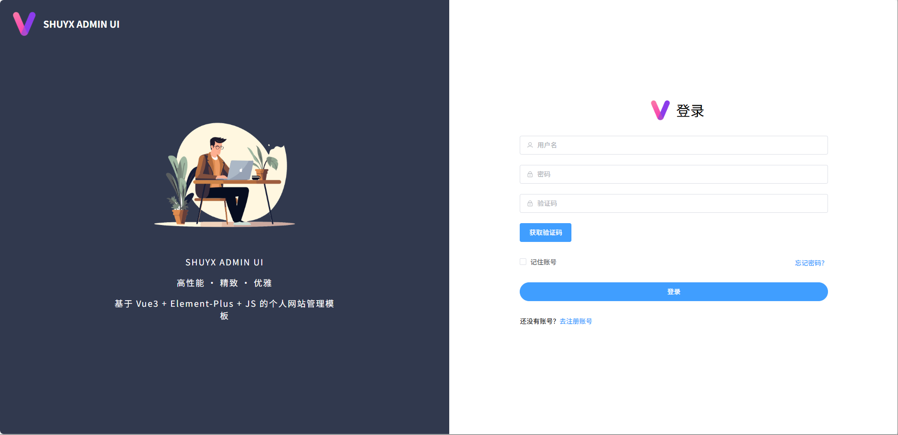
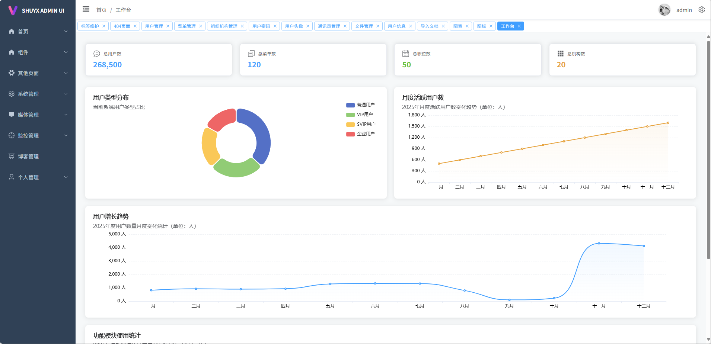
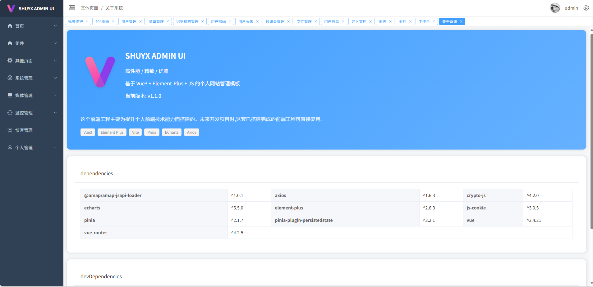
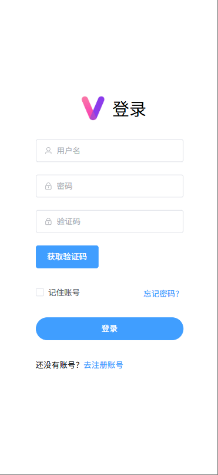
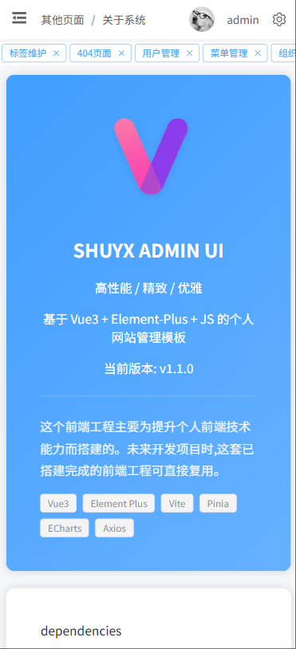

[toc]

# shuyx-admin-ui

## 简介
SHUYX ADMIN UI 是一个基于 **Vue3 + Element Plus** 的高性能个人网站管理后台模板，聚焦前端技术实践与工程复用。通过模块化设计、响应式布局和完善的依赖管理，为个人项目开发提供开箱即用的前端工程体系。

### 核心特性
- **技术领先**：采用 Vue3 组合式 API、Vite 构建工具、Pinia 状态管理等前沿技术栈
- **精致设计**：Element Plus 组件深度优化，包含渐变卡片、响应式布局、移动端适配等视觉方案
- **工程友好**：集成 ESLint 代码检查、Prettier 格式化、Mock 数据服务，支持快速二次开发
- **功能完善**：内置登录/权限、依赖展示、关于页面等基础模块，覆盖后台管理核心场景

### 体验优化
- **视觉设计**：Element Plus 组件深度定制（渐变卡片、悬停动画、阴影优化）
- **响应式布局**：支持 PC/平板/手机多端适配（小屏自动切换单列布局）
- **交互细节**：登录页表单校验、依赖展示页横向滚动（防止内容挤压）

### 工程友好性
- 内置 ESLint + Prettier 代码规范（统一团队协作标准）
- 集成 Vite Mock 服务（开发阶段无需等待接口）
- 清晰的目录结构（页面/布局/状态/接口分层明确）

## 项目截图







## 项目结构

```
shuyx-admin-ui/ 
├── public/ # 静态资源（无需打包的文件） 
├── src/ # 核心源码目录 
│ ├── assets/ # 静态资源（图片/图标/样式） 
│ │ └── logo.png # 项目Logo（被Layout/AboutView引用） 
│ ├── layouts/ # 全局布局组件 
│ │ ├── LayoutView.vue # 主布局（包含侧边栏/顶部导航） 
│ │ └── Header/ # 头部组件 
│ ├── views/ # 核心业务视图 
│ │ ├── home/ # 首页模块（含数据可视化） 
│ │ ├── system/ # 系统管理模块（用户/角色/机构等） 
│ │ └── other/ # 其他功能页 
│ │ └── AboutView.vue# 项目介绍页（展示版本/依赖） 
│ ├── mock/ # 模拟数据服务（Vite Mock） 
│ │ └── menu.mock.js # 菜单模拟数据（路由生成依赖） 
│ ├── router/ # 路由配置 
│ │ └── index.js # 路由定义（含动态路由逻辑） 
│ ├── stores/ # 状态管理（Pinia） 
│ │ └── mobileStore.js # 移动端状态存储（响应式布局） 
│ ├── utils/ # 工具函数 
│ │ └── menuRouter.js # 菜单转路由工具（router依赖） 
│ ├── api/ # 接口文件
│ │ └── org.service.js # 组织机构接口（system模块调用） 
│ ├── App.vue # 根组件 
│ └── main.js # 应用入口（初始化Vue/ElementPlus） 
├── .env.development # 开发环境配置（端口/接口地址） 
├── .env.production # 生产环境配置 
├── index.html # 应用入口HTML模板
├── vite.config.js # Vite构建配置 
└── package.json # 依赖清单与脚本配置
```


## 技术栈清单

| 分类         | 技术/工具                | 版本       |
|--------------|--------------------------|------------|
| 核心框架     | Vue                      | 3.4.21     |
| UI 组件库     | Element Plus             | 2.6.3      |
| 状态管理     | Pinia                    | 2.1.7      |
| 构建工具     | Vite                     | 5.0.10     |
| 网络请求     | Axios                    | 1.6.3      |
| 数据可视化   | ECharts                  | 5.5.0      |
| 开发工具     | ESLint + Prettier        | 8.49.0+3.0.3|

## 快速启动

安装依赖
```sh
npm install
```

启动开发模式
```sh
npm run dev
```

构建生产版本
```sh
npm run build
```


## 页面请求接口说明

对应的后台是shuyx-admin-service项目

当部署到Nginx服务器中的时候，需要配置请求转发。将/api开头的请求转发到网关gateway服务地址。

然后在网关gateway服务中，自行路由到对应的后台服务。


## docker 部署说明

docker目录中包含4个文件：

```sh
- Dockerfile # dockerfile文件，用于构建生产镜像（基于nginx镜像）,并将打包的静态页面复制到nginx静态目录，最后暴露端口10086
- nginx.conf # nginx配置文件，nginx容器需要的配置文件，也会被打包到nginx镜像中
- build_docker_images.sh # 构建docker镜像脚本，并将其推送到远程服务器的Docker仓库中
- docker-compose.yml # 该文件主要在远程服务器中执行，用于启动nginx容器
```

使用顺序：
1. 先通过执行build_docker_images.sh脚本构建生产镜像（基于nginx镜像），并将其推送到远程服务器的Docker仓库中。
2. 然后将docker-compose.yml文件上传到远程服务器的某个目录中。注意docker-compose.yml文件的同目录下还需要存在ssl目录，该ssl目录中需要包含证书文件。否则nginx容器无法读取到ssl证书，无法正常启动nginx容器。
3. 然后使用下面的命令，执行docker-compose.yml文件，启动nginx容器。

```sh
docker-compose up -d
```

